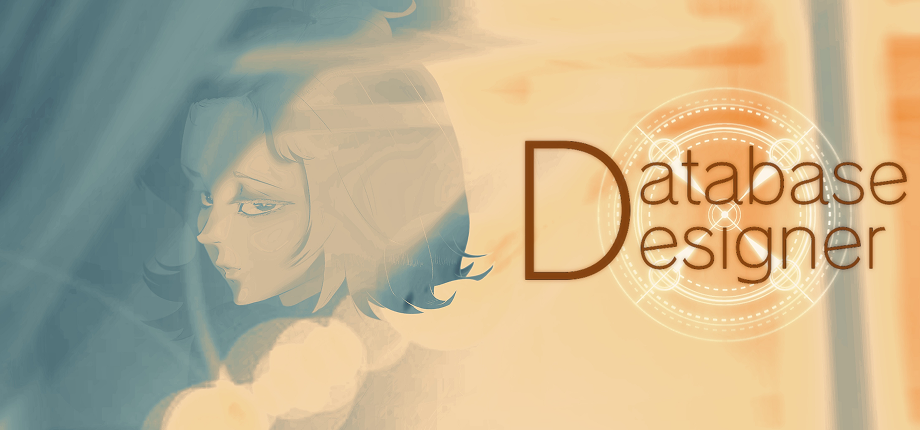

  

 <strong> A Free, Open Source Solution That Allows You To Create Backends Without Code</strong> 

 Database Designer is an offline, no-code PostgreSQL modeling tool that auto-generates SQL, documentation, and C# Entity Framework with PQC-resistant security. 

 <strong>Windows • Linux (Soon) • Fully Offline • Post Quantum Computing Resistant • No BS</strong> 

## How It Works

**Database Designer** provides a visual, schema-first workflow for building application backends. It generates:

✅ **Complete SQL files** — schemas, tables, references, and indexes ready to deploy  
📘 **Markdown documentation** — clean, exportable, and team-friendly  
💻 **Entity Framework–ready C# classes** — plug-and-play with your applications

Instead of writing raw SQL or juggling migrations manually, you:

- Design tables visually
    
- Define relationships and constraints explicitly
    
- Generate schemas, documentation, and code artifacts
    
- Keep everything offline and under your control
    

The tool is designed to stay **out of your runtime** — it helps you _design_ systems, not lock you into them.

This github contains *all* the code for Database Designer in it's form when released; messy, digusting and functional (somehow)!
Beyond this, a few things project wise has to be cleaned up eventually (Such as unused images and the like)!
I'll possibly one day clean it but for now we are good

---

## 📖 Useful Links

For full documentation, guides, and tutorials, check out the **official wiki**:  
[Database Designer Wiki](https://walker-industries-rnd.github.io/Database-Designer/welcome)

Want to get the app or support the project? Head over to **Steam**:  
[Database Designer on Steam](https://store.steampowered.com/app/4098880/Database_Designer/)

Want to see how your data is protected? Look at **Pariah Cybersecurity**;
[Pariah Cybersecurity Wiki](https://github.com/Walker-Industries-RnD/PariahCybersecurity)

---

## Meet the Team

|  |  |  |  |  |  |
| ----------------------------------------------------------- | ------------------------------------------------------------------------------------------------------------------------------------------------------------ | ------------------------------------------------------------------------------------------------------------------ | -------------------------------------------------------------------------------------------------------------------- | -------------------------------------------------------------------------------------------------------------------------------------------------------------------------------------------------------------------------------------- | ----------------------------------------------------------------------------------------------------------------------------------- |
| **Alain** QA & Creative Feedback   “Quis ut Deus?” | **IiErickiI** QA & Creative Feedback  “The fake is of far greater value. In its deliberate attempt to be real, it’s more real than the real thing.” | **Jpena173** Backend Support / Development Help  "I cant think of a quote you can leave it alone for now" | **KennaJoSmith** Lead Artist  “Hmu I draw furries” [Instagram](https://www.instagram.com/kenna_jo_smith) | **WalkerDev** Founder / Lead Developer  “Don't be afraid of change—Think of it as something that'll open the door to deeper, more precious feelings for you in the future.” [YouTube](https://www.youtube.com/@walkerdev1) | **Chubu** QA & VN Artist   "If you don't know how to do something, keep doing it! You'll figure it out eventually! :3"  |

---

---

## 💜 Meet Masuki-chan! 🐰

H-Hey! Don’t just stand there, baka! I’m Masuki-chan, and I’m *stuck* helping you with **Database Designer**… so don’t mess it up, got it?!  

A few things you *need* to know about this app (not that I care if you read it or not!):  

**DatabaseDesigner** – the main OpenSilver application (requires the following):  
- **Pariah Cybersecurity** (by WI, open source and free… duh)  
- **NAudio** (might disappear in the future, so don’t get used to it!)  
- **z440.atl.core**  

It also has **assets**, like **PariahAPI** — a local version of Pariah Cybersecurity. Yeah, yeah, it’s mostly for security stuff. Undoing it would take forever, but fine, performance isn’t hurt, so whatever.  

**DatabaseDesignerDLL** has the bare logic needed for the app. The main application… *ugh*, it just copies the builder script code directly instead of referencing the DLL. Don’t ask why, okay?!  

So stop wasting your time staring at nothing and start actually using the app already! Not that I care if you succeed… but don’t embarrass yourself, baka!  

## What’s In Here

|Area|Description|
|---|---|
|**UI / Table Editor**|Visual table, column, and relationship editor|
|**Templates**|Predefined schemas and table layouts|
|**Validation System**|Naming rules, duplicate prevention, schema checks|
|**Exporters**|SQL, documentation, and code-ready structures|
|**Project System**|Organize schemas by project and schema namespace|

---

## Using Database Designer

You do **not** link it into your application.  
You **design**, **export**, and **implement** however you want.

**Typical workflow:**

1. Create or open a project
    
2. Define schemas and tables
    
3. Add columns, indexes, and relationships
    
4. Validate structure
    
5. Export SQL / docs / models
    

- No runtime dependency
    
- No forced framework
    
- No surprises
    

---

## License & Artwork

**Code:**  
[NON-AI MPL 2.0](https://raw.githubusercontent.com/non-ai-licenses/non-ai-licenses/main/NON-AI-MPL-2.0)

This software is licensed under MPL 2.0 **with the following exception**:

> You may not offer this software, or any derivative work, as a hosted service, SaaS, or online application to third parties without explicit written permission from the licensor
> 
> All output created by the software belongs solely to the user, including derivative work of the output. This does not grant rights to modify or redistribute the software itself except under the terms of this license.

**Artwork:**  
© Kennaness — **NO AI training. NO reproduction. NO exceptions.**

> Unauthorized use of the artwork — including copying, distribution, modification, or inclusion in any machine-learning training dataset — is strictly prohibited and will be prosecuted to the fullest extent of the law.

